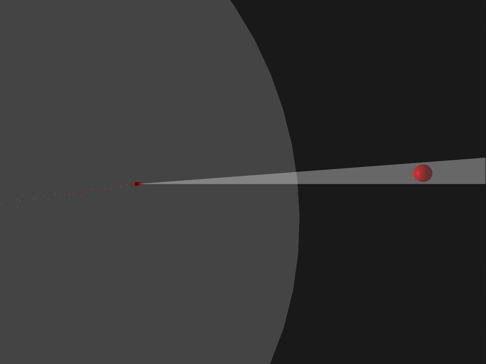

<h2  style="margin-bottom: 0px;">OpenGL Missile Simulation</h2>

  

**<u>Description:</u>**

- Basic missile simulation using proportional navigation, combined with a custom physics simulator for bouncing sphere on sphere and sphere on bounded plane. Uses Continuous Collision Detection (CCD) to detect collisions.
- Missile proportional navigation (pronav) uses tuned properties to achieve optimal interception of target, examples are setting the correct gain for pronav and missile turn rate to achieve the optimal flight path angle.
- Proportional navigation achieves collision with target once line of sight rate (LOS rate) is zero or near zero, great resources exist such as Ben Dickinson on YouTube or Basic Principles of Homing Guidance by Neil F. Palumbo, Ross A. Blauwkamp,
and Justin M. Lloyd.
- The benefit of CCD is the ability to prevent high-speed tunneling (objects passing through one another) and calculating precise collisions.
- The biggest challenge of CCD is calculating the Time of Impact (TOI). Two methods used is Analytical and Conservative Advancement.
- Analyical solving is much faster but not as reliable and flexible as Conservative Advancement.

**<u>--- CONTROLS ---</u>**
- Left Alt - Lock/Unlock Camera to Mouse
- Escape - Exit Program
- 1 - Camera 1 (Missile chase cam)
- 2 - Camera 2 (If it exists in level)
- W - Add forward velocity to missile
- A - Add left velocity to missile
- S - Add back velocity to missile
- D - Add right velocity to missile
- R - Enable/Disable Missile Seeker
- F - Deploy Flares
- Space - Enable missile's engine (3 Sec burn time)
- Left Shift - Lock target within gimbal limit
- Left Arrow - Rotate counter-clockwise
- Right Arrow - Rotate clockwise
- M - Load fast missile level
- N - Load slow missile level
- B - Load alternate slow missile level
- U - Unload level
- L - Load level with spheres
- T - Load level with moving plane
  
  **<u>-- FEATURES --</u>**
- Working basic missile simulation using proportional navigation with an engine and proxy fuse
- Continuous Collision Detection solver with both conservative advancement and analytical Time of Impact (TOI) solver
- Bounded plane collisions with dynamic normals for edge collisions (only for sphere and plane collisions)
- Working particle system for missile and explosion
- Sphere on sphere collisions using impulses
- Dynamic level loading with JSON level data
- Seeker object tracking with gimbal limits

**<u>Currently:</u>**

Basic missile simulation and sphere physics simulator

**<u>Endgoal:</u>**

A basic lightweight missile simulation using OpenGL. Simulates infrared target tracking, simplified aerodynamics, IRCCM, thrust vectoring, and proximity fuse.

**<u>Requirements</u>**

- Windows 10 or 11

- OpenGL 4.6

- Visual Studio 2022+ (Desktop Dev w/ C++)
